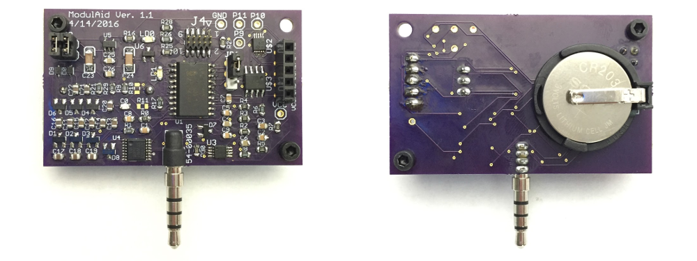
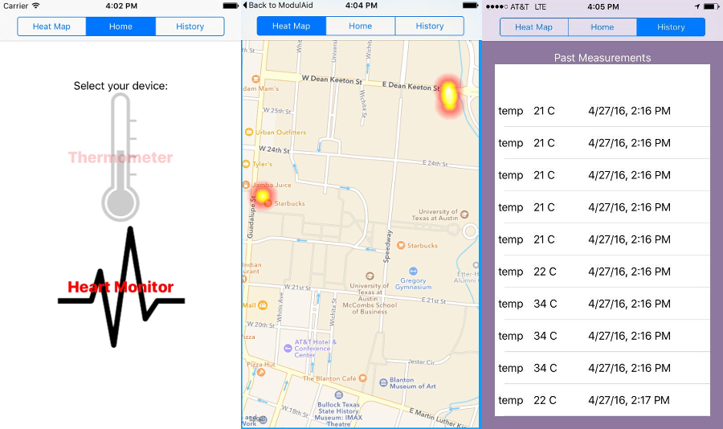

# Modulaid

### Overview
ModulAid was born at UT Austin as a Senior Design Project for 5 Electrical Engineering [students](#contributors). Their senior design class was a special section called "Startup Senior Design" and the students thought up their own project rather than doing an industry or faculty sponsored project.

ModulAid extends a smartphone by providing an easy to use interface for many different types of sensors. The main hub plugs into the smartphone via the headphone jack. Through the connection with the headphone jack, the board is able to communicate with the iOS app as well as harvest power. Sensors can then be attached to the shared sensor board. The board acquires data from the sensors, transmits it to the smartphone, and from there it is displayed to the user.

The team chose to focus on making ModulAid a system for medical devices. The ModulAid app was designed to make access to health information very cheap. The team wanted to make it as easy as possible for people to get insights about their own health and the health in their communities.

### Hardware
Our initial development was done on the NXP Quick-Jack development kit. Then we designed a 2.4 x 1.45 inch PCB, shown below. The Quick-Jack acted as our reference design but with unnecessary components removed and additional components added to satisfy design requirements.

Connecting the board with the phone is as simple as plugging it into the headphone jack. All communication with the phone is done through the four-terminal headphone jack. The four pins in the headphone jack are left audio, right audio, microphone, and ground.

The right audio channel is dedicated to transferring power through a constant audio wave. The signal is fed into a voltage rectifier that converts the low voltage AC signal into a higher voltage DC signal. The DC voltage is fed into a 3.3V regulator that produces a constant voltage for the microcontroller and sensors. The max power that can be harvested from the phone is about 15mW, but the exact value varies from phone to phone. The board also has a CR2032 battery on the back. When additional current is needed for a sensor, it can be drawn from the battery.

Besides providing power to the sensors, the board must be able to communicate with them. We created our own sensor interface so that all our sensors connect through the same port. All our compatible sensors fall into two categories, either those that produce an analog voltage signal or those that communicate through a peripheral on the microcontroller. We added a 2 channel 10-bit ADC (MCP3002) and a dual SPDT (single pole double throw) analog switch (TS3A24157). The signal lines from the sensor port connect to the common inputs of the SPDT switch. The firmware controls the input to the switch to either connect the sensor signals to the ADC or directly to the microcontroller. The schematic is included in the Hardware directory.

### Firmware
The firmware runs on the microcontroller(NXP LPC812) of the ModulAid board. The purpose of the firmware is to create a channel of communication between the smartphone and the various sensors. The firmware receives commands from the smartphone, initializes the hardware, acquires data, and sends the data to the smartphone. Upon reset of the device, the firmware performs the needed initialization for the device, then waits to receive a command from the phone. The command tells the firmware which sensor the user has selected. This is necessary because each sensor communicates with the board differently and requires a unique initialization. For example, the board uses I2C (Inter-Integrated Circuit) to communicate with the IR thermometer, but reads a voltage through the ADC (Analog to Digital Converter) with SPI (Serial Peripheral Interface) for the pulse sensor.

To use the ADC, first we must set the input to the dual SPDT switch such that the sensor wires connect to the inputs of the ADC. We then can sample the ADC by sending a command through SPI to the ADC. The command wakes up the ADC from its sleep state. From there it samples the requested input channel and sends the 10 bit result back. For some sensors, the raw ADC value might be a meaningful piece of data, but in the case of the pulse sensor we must take periodic readings that can be processed into a heart rate in beats per minute (BPM). The pulse sensor readings create a pulse wave. We calculate the BPM by measuring the time between peaks of the waves. The firmware keeps a running average of the BPM and when requested send the value to the smartphone.

For all sensors that don’t make use of the ADC, the input to the dual SPDT switch is set such that the signals from the sensor connect directly to the pins of the microcontroller. The microcontroller, the NXP LPC812, has an internal switch matrix that allows the hardware peripherals to be connected to almost any chosen pin. Because of this switch matrix, we can use the same set of pins for various communication protocols. When the IR thermometer is connected, the firmware assigns the I2C function to the sensor pins. Through the I2C bus, we can poll the thermometer for its most recent temperature reading.

The current hardware revision supports sensors that output an analog voltage or communicate through I2C or UART. SPI could be used for sensor communication if one more signal line was added between the microcontroller and the sensor port.

### iOS Application
The application user interface is the main “face” of the product for a user. Our goal in designing the user interface was to make the application so easy to use that it required no instruction. To accomplish this goal, we decided to use pictures rather than words whenever possible. This way, people of different cultures could use the same version of the app. Screenshots of are included below.

The user interface has three views that carry out the main functions of the application. There is a Home view, a Heatmap view, and a History. The Home view is where the user goes to take a measurement. From the Home view initial screen, the user selects which type of measurement they want to take. After the user selects their device, they are guided by a series of visual prompts to take the reading. In Heatmap view, the user can see what other ModulAid activity is happening around them. The Heatmap shows the locations and relative temperatures of other users. The heatmap is one example of real time health analytics that ModulAid offers, and in the future, it could be used to analyze the health in communities. In History view, a user can see the recent sensor measurements that were taken locally on their personal device.

All collected data is stored anonymously to a FireBase database. Along with the data point we store the location. Further insights and analytics could be generated from this data. The heatmap is one example of this, providing a way to plot the location and severity of fever on a map.

### Demo
Here is a short video demonstrating the functionality: https://vimeo.com/168209562

### Going Forward
Due to the project’s scope in the Senior Design class, ModulAid only supports two sensors, a thermometer, and a heart rate monitor. There are many ways the project could move forward:      
	-Add support for additional sensors     
	-Create user accounts to give more specialized health insights      
	-Create an Android app similiar to the iOS app       
	-Rework the firmware to deal with sensors in a more generic way, allowing new sensors to be added without updating the firmware.    
-and probably many more..

We created this GitHub Repository to document our project and let it live on through the internet. We hope someone out there finds it useful, helpful or even inspiring. Furthermore, the platform is not limited to medical sensors and could be a base for interfacing all sorts of sensors with a smartphone.

### Resources
ModulAid draws from several projects and frameworks:

NXP QuickJack: http://www.nxp.com/products/microcontrollers-and-processors/arm-processors/lpc-cortex-m-mcus/lpc-cortex-m0-plus-m0-mcus/lpc800-low-cost-cortex-m0-plus-mcus/om13069-smartphone-quick-jack-solution:OM13069

LFHeatMap: https://github.com/gpolak/LFHeatMap

Firebase: https://www.firebase.com/

### Contributors
Alex Lee, Cage Johnson, Sam Moser, Alejandro Silveyra, and Ammar Hazim (in order of appearance)    
Photo of team at UT Austin Electrical and Computer Engineering Senior Design Open House - Spring 2016

We would also like to thank our faculty mentor, Ramesh Yerraballi, for his support through out the project.

